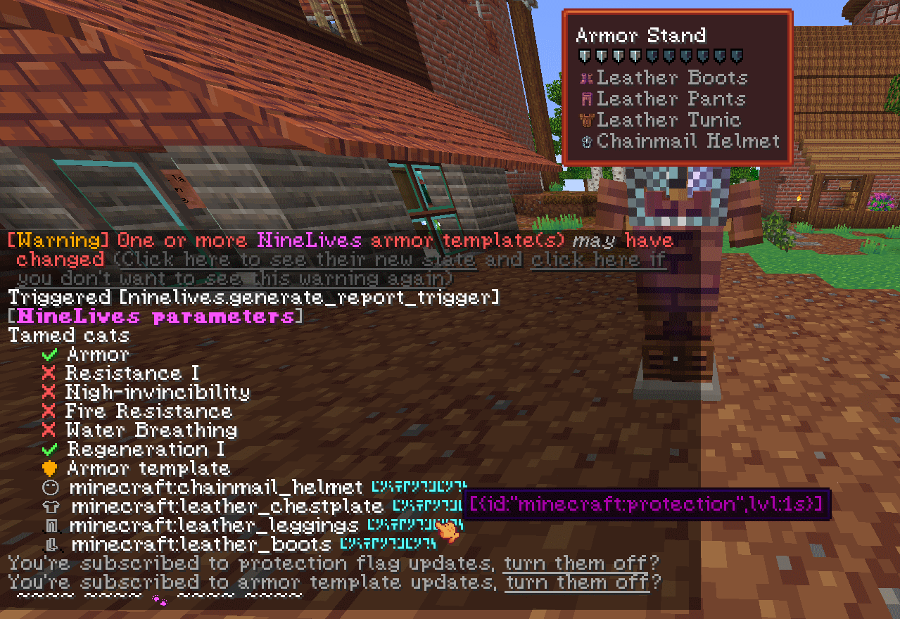

#  NineLives datapack v0.4

A datapack for protecting tamed cats from harm in toggleable ways,
with some abstractions from the entity type
to more easily extend it to others in the future

Tested on version 1.20.1 with the BCG modpack (shouldn't be required)

## Available options

### Potion effects

- Regeneration I
- Water Breathing
- Fire Resistance
- Resistance I
- Highest possible level of resistance

### Armor

Just set the flag then give the proper tag to a *single* armor stand
and it will determine the armor to grant in real time

Chat messages will guide you as to which tag(s) to give it
and warn you if no armor stand – or too many – can be found!

## Considered future options

- Totems of Undying (count parameterable within reasonable bounds)
- Ability (and requirement) to physically give the totems or armor

## Player "commands"

All accessed through clicks on specific chat messages
or manually with `/trigger`
- Get a report of the current protection policies and armor sets
(and toggle [warnings](#for-players) for when they change)
- Check how many [incomplete runs](#technical) – if any – the pack detected

Example
:-:

Considered features
- Built-in voting system (easy to abuse if too simple, sadly)

## Admin commands

Feature | Command (`function ninelives:`) | Requires command knowledge
-|-|:-:
Toggle protection policies | `edit_flags/*` | ❎ No
Count entities\* | `count_entities_of_interest` | ❎ No
Reload the pack without `reload` | `soft_reload` | 🤏 A little\*\*
Reset incomplete run detection | `reset_could_not_run_fully_warning` | ❎ No

Other functions are simply an easier access to player "commands"

\* for now, cats, with a second count for tamed ones

\*\* In-depth explanation:
the `reload` command processes files for all datapacks again,
which can be long if others are installed,
so to call this one's loading logic again
(typically when suggested by a message),
you may use `function ninelives:soft_reload`,
which is equivalent to `function #minecraft:load`
if you have no other datapack installed  
`reload` is still necessary if you've made changes to the files

## Safeguards

### For players

Warnings when the protection policies – or armor sets – change
- Still works if they were changed while they were away
- Can be turned off (or back on) at their choosing

### Technical

- Detects if scoreboards or storage were broken and waits until a reload to run
- Should recover from any damage on reload if not automatically
- Detects incomplete runs if the remaining command count budget is very limited
- Issues warning/error messages when an issue is detected, with steps to fix it
